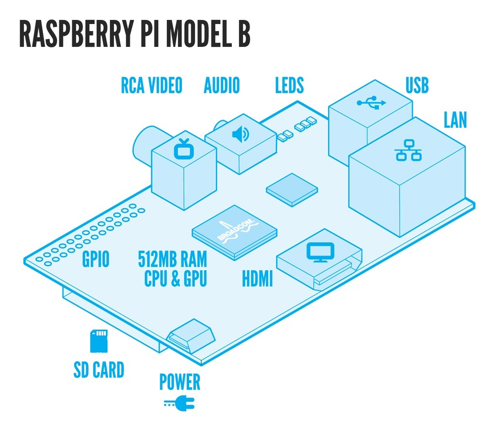

title = 'Pre-Class Equipment Purchase and Setup'

# Lesson 0 Notes

## Lesson Outline

- Required Equipment
- Install Arch Linux
- Set Everything Up

## Required Equipment

We'll be using a small, single board computer called the
[Raspberry
Pi](http://en.wikipedia.org/wiki/Raspberry_Pi).  It
doesn't have any onboard storage, so you'll also need to
purchase an SD card.

Here's a place where you can get them as a bundle for $37.50: http://www.alliedelec.com/Search/ProductDetail.aspx?SKU=70313519

If you don't opt for the bundle, make sure you get an SD card with **at least
8GB** capacity (the OS itself is ~2GB and we'll install stuff on top of that!).
Also, make sure you check the card against [this
listing](http://elinux.org/RPi_SD_cards) to ensure it's compatible.

Make sure you get the **B Model** of the Raspberry Pi.

You'll also need:

- USB Keyboard
- USB Mouse
- MicroUSB Power Supply
- Cable / Adapter to connect from HDMI to your monitor
  - The Raspberry Pi only has an HDMI output port
  - All lab monitors have DVI ports.  I have HDMI to DVI
    adapters, and you're free to use those.  But if you
want something for your room, you should get your own.
  - http://www.monoprice.com is a great site for cables
    / adapters.

## Set Everything Up

This picture should make setup a bit easier:

- Hook up your HDMI cable (and adapter if necessary) to your monitor
- Plug in your USB keyboard (and mouse if you want, but we won't need it for a while)
- Plug in a working Ethernet cable
- Insert your SD card
- Attach your MicroUSB power supply (this will power it up!)

If you got the bundle, the pre-installed software on your SD card is called [NOOBS](http://www.raspberrypi.org/archives/tag/noobs).

If you didn't get the bundle, you'll need to install an operating system before you see anything on the screen.

## Install Arch Linux

Install Arch Linux - you can do this either through NOOBS or get the image directly and write it to your SD card.  It's available at:
http://archlinuxarm.org/platforms/armv6/raspberry-pi.

## Logging In
